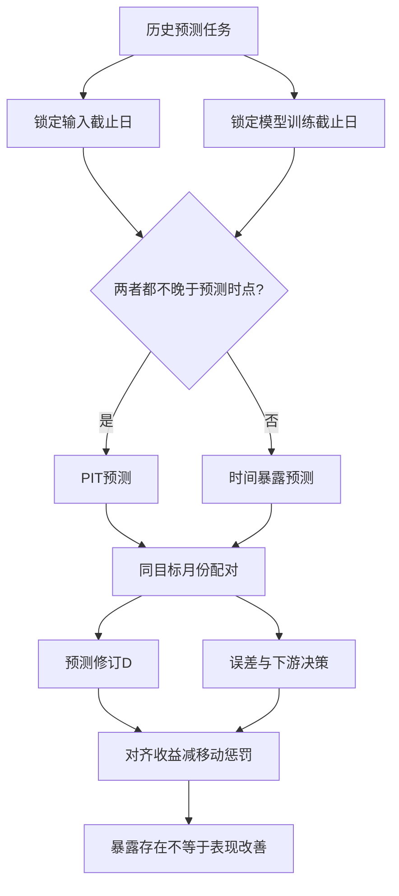

# 用未来数据训练真的有用吗？预训练预测模型中的前视偏差

英文原题：Does Training on Future Data Pay? Look-Ahead Bias in Forecasting with Pretrained Models

arXiv：2609.20554v1；方向：经济；发布日期：2026-09-17

一句话问题：回测 2010 年预测时只输入 2009 年前数据，为什么用训练到 2015 年的模型仍不算实时可行？这种泄漏一定让成绩更好吗？

## 锁住输入日期，还漏了一扇“参数时间”的窗

你让模型预测 2010 年收益，输入确实只到 2009 年；但模型权重是在看过 2010—2015 年许多市场序列后学成。它不一定记住答案，却已经不是当时可拥有的预测规则。

论文利用按年份独立训练的五类金融时间序列基础模型，把同一历史、同一目标交给不同年份的参数状态。读完后你应能区分 temporal exposure（时间暴露）和它是否改善预测；本文不提供交易策略。

## 整体关系图



## 两条时间线：输入截止与训练截止

forecast origin 是作出预测的历史时点；输入历史必须止于此处。model vintage 是某次训练得到的参数版本，也有自己的训练截止日。只有两条截止线都不越过 origin，历史回测才满足 point-in-time（PIT）信息约束。

前视暴露是设计属性：参数接触了未来。预测增益是结果属性：误差是否变小。泄漏可以让预测改变但变差，因此“没赚到”绝不能反推“没有泄漏”。

## 年度模型版本如何形成配对实验

作者使用 Chronos 三个尺寸和 TimesFM 两个尺寸的年度独立版本，在美国、全球、全球加因子三种训练环境下，预测美国股权溢价及 13 个非美市场，期限为 1、3、6、12 个月。

每个配对固定市场、预测时点、数值历史和推理过程，只替换模型年份。T-1 是 origin-aligned PIT；T、T+1、T+2 含未来训练覆盖。固定版本设计则让目标窗口穿过同一训练截止线。

## 先验证 PIT 规则本身有没有信息

若 PIT 模型本来就不优于简单历史平均，后来版本更差没有多少经济含义。论文先验证 PIT：美国样本中 Chronos Tiny 相对历史平均的 MSFE 在 1 个月降低 3.45%，6 个月降低 15.12%。

然后才问替换参数版本会怎样。TimesFM 20M 的一个月美国预测在首次跨越 origin 时，27.9% 的月份连预测正负号都改变，说明变化不是简单缩放。

## 大改预测不等于纠正错误

令 PIT 误差为 e、后来版本相对 PIT 的修订为 D。平方损失改善可拆成“修订是否朝 PIT 错误的反方向移动”的对齐收益，减去“修订幅度平方”的移动惩罚。方向不准时，动得越大反而越差。

美国训练环境下，后来版本在 20 个模型—期限组合中的 18 个劣于 PIT，中位 MSFE 差为历史平均 MSFE 的 -5.94 个百分点。加入的只是 origin 前数据时平均改善 0.72 点；首次越过 origin 时反而恶化 5.65 点。

## 用审计表逐项查时间

对每个预测单元记录：目标开始和结束、输入最后日期、模型训练最后日期、模型版本、训练市场范围、匹配样本。训练日期只决定是否暴露，实际误差和投资效用另算。

国际市场即使没直接进入美国训练集，也可能从共同因子和相关市场间接接触未来。论文称其 indirect exposure，所以“删掉目标列”不能自动修复时间泄漏。

## 主要结果为何反直觉

美国训练环境下，20 个美国组合中 18 个的 pooled later vintage 不如 PIT；13 个非美市场的中位效果在 20 个组合中全部偏向 PIT。无交易成本的约束均值—方差策略中，后来版本相对 PIT 的年化确定性等价收益中位差为美国 -1.77 点、国际 -2.14 点。

但训练内容会改结论：美国目标使用全球训练时，中位滚动效果从 -5.94 转为 +1.37 点，加因子后又为 -3.64 点。暴露不是单向“作弊加分器”，其后果取决于后来参数与早期市场结构是否对齐。

## 年度版本比较仍不是纯粹的数据增量实验

每个年度版本独立训练，所以替换 vintage 同时改变随机训练结果与拟合规则，不能把差异全部解释为“多看一年数据”的因果效应。PIT 只描述训练信息时间，不表示当年的投资者真的拥有这些后来发布的架构。

市场、模型家族、配置和资产分配规则有限；投资结果未扣交易成本。教学 demo 使用人造目标和预测，只验证时间审计与损失分解，不重现任何论文收益。

## 回测可信度的最短检查链

先固定历史任务；同时锁住输入截止和参数训练截止；在相同目标月份上配对 PIT 与替代版本；先确认 PIT 有预测信息；再分别报告预测修订、误差和下游决策；最后按直接与间接训练范围解释暴露。

结论不是“未来训练无害”，而是“泄漏存在与泄漏是否帮助是两个问题”。即使后来版本表现更差，它仍不属于当时可执行的回测。

## 最小实践：泄漏模型可以改很多、却预测更差

需求：固定同一组真实值，比较 PIT 预测和一个带未来训练暴露的版本；逐期打印修订、平方误差和净改善。正常例显示暴露版总体更差，边界说明人工数组不能代表真实市场。

实际运行输出：

```text
期  真值  PIT  暴露版  修订D  PIT误差平方  暴露版误差平方
 1   1.0   0.6     1.3     0.7        0.16            0.09
 2  -0.5  -0.1     0.4     0.5        0.16            0.81
 3   0.7   0.4    -0.2    -0.6        0.09            0.81
 4   1.4   0.8     1.8     1.0        0.36            0.16
 5  -0.2   0.1     0.5     0.4        0.09            0.49
PIT MSE=0.172；暴露版 MSE=0.472
边界：数据为教学数组；它只说明时间暴露与准确率是两件事，不代表任何真实资产表现。
```

## 自测题

1. 为什么输入数据完全按历史截断，仍不能保证回测无前视偏差？
2. 后来版本预测更差，能否把它当成无泄漏版本继续使用？
3. 若目标市场未进入训练集，还要审计哪些间接信息？

## 原文与阅读范围

已读取时间定义、滚动与固定版本设计、PIT 基准、预测修订、误差分解、组合评价和限制；核对表 1—8及图 1—7。

作者证据来自年度金融 TSFM 的历史配对。教学数组为自造；不构成投资建议，也未复现模型推理或组合。

本次保存并解析的正文格式为 arxiv_html，提取到 3 个相关章节、53 条图表说明，正文约 338,629 个字符。

原文：https://arxiv.org/html/2609.20554v1
