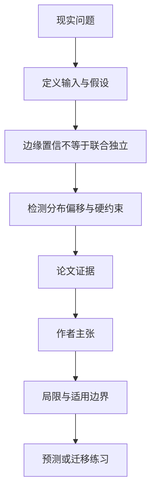

# 离散扩散模型的“高置信并行填词”为何可能改变整体分布

英文原题：Limits of Confidence in Diffusion

arXiv：2609.20581v1；方向：AI；发布日期：2026-09-17

一句话问题：每个空位都很有把握时，把多个 token 一次填上，为什么仍可能生成训练数据中不该出现的组合？

## 先从一个普通人会遇到的问题开始

局部置信度像是分别问“每个座位最可能坐谁”，但整排座位可能受“家庭必须坐在一起”这类联合约束；论文证明边缘概率不能告诉采样器多个位置是否可独立并行。

今天读完《离散扩散模型的“高置信并行填词”为何可能改变整体分布》，目标不是记住论文名，而是能用自己的话回答：每个空位都很有把握时，把多个 token 一次填上，为什么仍可能生成训练数据中不该出现的组合？还要能指出作者的证据支持到哪一步、哪一步仍不能下结论。

## 整体关系图



## 先补两块必要基础

marginal（边缘分布）只描述单个位置各取值的概率；joint distribution（联合分布）描述多个位置的组合概率。两个联合分布可以有完全相同的边缘概率，却允许不同组合。

离散 diffusion/remasking 从全遮罩开始，多轮选择若干位置并从每个位置的分布独立采样。一步写多个位置等价于使用这些边缘分布的乘积。

## 论文接收什么，输出什么

输入是当前已固定 token、每个未定位置的预测分布和调度器选择的写入位置组。输出是这一轮新写入的 token 以及最终序列分布。

核心判据是：给定当前上下文，被同时写入的位置必须条件独立，乘积分布才可能与训练联合分布一致。置信排名本身不包含这种依赖信息。

## 第一步：区分“每格很确定”和“组合可独立”

即使位置 A 与 B 各自都是 90% 置信，训练数据也可能只允许 A、B 同值。独立抽样会产生一个高边缘概率但联合上禁止的异值组合。

论文证明任何逐位置乘积都无法精确表示一个依赖位置组；更强的是，只看各位置分布甚至无法判断这个组有没有依赖。

## 第二步：用联合分布或硬约束检查真实偏移

在联合分布可计算的 ScanAndAdd 合成任务上，可以用 total variation 距离与采样噪声地板比较；只看单样本“看起来正确”会漏掉整体频率偏移。

在真实语料无法写出完整联合分布时，可检查已知硬约束，如固定计数、校验和或括号配对；并行写入依赖组若越出支持集，会留下直接违规。

## 跟着一个小例子看中间状态

教学分布只允许 00 和 11，各占一半。单看两个位置，每个都是 0/1 各半；独立并行采样却会把 01 和 10 各生成四分之一。

若先采第一个位置，再让第二个条件于第一个，组合仍只会是 00 或 11。代价是少了并行速度，这正是论文讨论的准确分布与并行度边界。

## 作者拿什么证据支持主张

在 ScanAndAdd 上，论文能闭式计算联合分布，并验证置信调度器写入的任意两个以上未定位置都存在依赖；生成分布的 total variation 距离达到采样噪声地板的 29 倍。

同时，well-formedness、correctness 和 uniqueness 等逐样本指标可达到 1.0，说明“样本都合法”仍不能推出出现频率与训练分布一致。

## 哪些结论不能顺手扩大

主要证据来自合成数据和研究模型，不等同于任何产品级图像或文本扩散架构；一个额外学习联合依赖的调度器不被排除。

定理限制的是依赖组上的独立乘积步骤；温度、搜索等其他干预也会改变分布。真实语料的联合分布通常不可得，因此误差规模未必能直接测出。

## 把整条因果链重新接起来

研究问题“每个空位都很有把握时，把多个 token 一次填上，为什么仍可能生成训练数据中不该出现的组合？”先被拆成可观察输入，再经过“第一步：区分“每格很确定”和“组合可独立””与“第二步：用联合分布或硬约束检查真实偏移”，最后由论文实验或数据核对。

排错时依次检查：输入是否代表真实问题、中间状态是否按定义计算、比较组是否公平、指标是否回答原问题、结论是否越过样本和假设边界。

## 最小实践：把核心机制跑一遍

需求：用一组明确标为教学设定的小数据演示“展示相同的逐位置 50/50 边缘如何对应完全不同的联合组合”。脚本打印输入、中间状态、正常例和失效边界，便于逐步核对。

验收标准：输出能解释机制方向，并明确它没有复现论文数据、模型或效果数字。

实际运行输出：

```text
教学输入：
- 训练允许组合：['00', '11']
- 独立乘积组合：['00', '01', '10', '11']
- 各边缘：0/1 各 50%
中间状态：
1. 检查位置一的边缘为 50/50
2. 检查位置二的边缘也为 50/50
3. 独立相乘产生四种组合
4. 01 与 10 违反训练支持集
正常例：逐个条件采样能保留两位置相同的约束，并行独立采样不能。
边界：这是二位分布算例，不是论文的 ScanAndAdd 模型训练或真实扩散系统测试。
```

## 自测题

1. 若每个位置的最高置信度都是 0.99，能否据此证明两位置可并行？
2. 为什么 correctness=1.0 仍可能有严重分布偏移？
3. 真实文本不知道联合分布时，可以先检查哪类信号？

## 原文与阅读范围

已读理论条件、反例构造、ScanAndAdd 实验、限制与结论；核对图 1—2、表 1—3 及 total variation 噪声地板。

教学中的日常类比、演示数据和运行结果由本学习包构造；作者主张与论文证据已在正文中单独标出，二者不混用。

本次保存并解析的正文格式为 arxiv_html，提取到 5 个相关章节、12 条图表说明，正文约 74,682 个字符。

原文：https://arxiv.org/html/2609.20581v1
