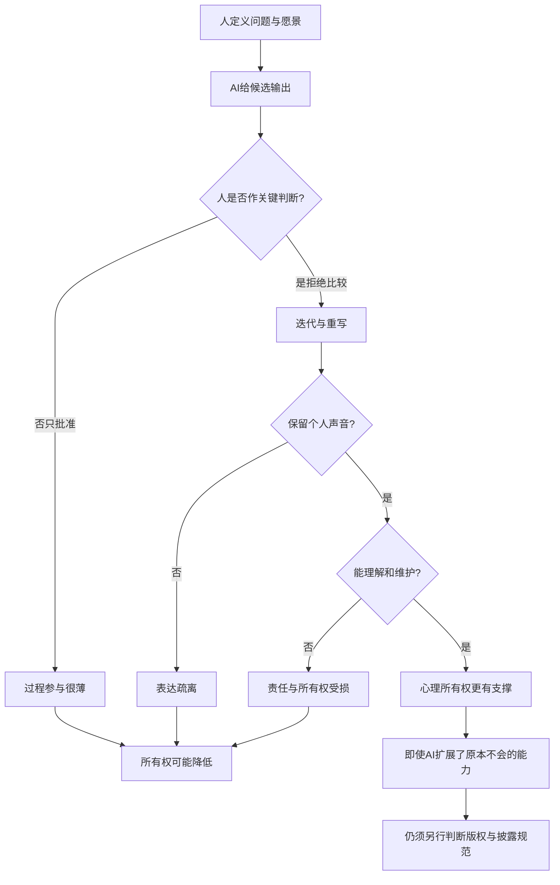

# AI 帮我做的作品，什么时候还算“我的”？

英文原题：Ownership in AI-Assisted Everyday Tasks

arXiv：2609.20658v1；方向：社会研究；发布日期：2026-09-17

一句话问题：为什么 AI 画出了自己不会画的绘本仍可能很有“我的作品”感，而让 AI 代写一封普通邮件反而不像自己的？

## 关键不是谁敲了更多字，而是谁作出了关键决定

一个不会画画的人定下故事、角色和画面，多轮否定并重做 AI 插图，最后可能强烈认为绘本属于自己。另一个人把可独立完成的邮件整段交给 AI，只点了“接受”，却可能觉得成果与自己无关。

论文用探索性问卷比较同一受访者最近一次高所有权和低所有权的 AI 任务。读完后你应能用过程领导、个人声音、能力扩展和理解责任四条线诊断所有权感，而不把它误成法律著作权结论。

## 整体关系图



## 心理所有权不是法律所有权

felt ownership 是“这件事像是我做的、我愿意为它负责”的主观感受。它不自动决定版权、署名或组织合规。cognitive offloading 则是把思考工作交给工具，可能节省精力，也可能削弱理解和参与。

作者关心的是协作过程：人是设定方向、判断取舍和重写，还是只批准机器建议；成果是否保留个人表达；使用者能否解释并维护输出；AI 是否让人实现原本做不到的愿景。

## 调查实际收集了什么

117 人开始问卷，52 人完整完成，64 人至少描述了一个任务。参与者从最近 30 天中各选一个高所有权和低所有权的 AI 辅助任务，回答能否不用 AI 完成、个人贡献、身份、骄傲和是否愿意披露 AI 使用。

招募来自作者职业网络、社交媒体、大学邮件和 Slack，样本偏向教育程度高、职业中后期、重度使用且能付费使用 AI 的白人成年人。结果来自定性主题比较，不是代表性人口估计。

## 过程领导比“在环中”更重要

受访者把方向设定、关键判断、迭代和重写视为自己的贡献。只审阅或点击接受虽然 technically in the loop，却可能没有决策控制，因此所有权低。

AI 的糟糕草稿有时反而提高所有权：它提供一个可反对的反例，人通过指出哪里不对而澄清自己的标准。这里的机制是主动判断，不是坏输出本身有价值。

## 不会亲手执行，也可以拥有愿景

高所有权任务中只有 42% 的回答是“肯定能不用 AI 完成”，低所有权任务反而有 63%。作者据此提醒：能力依赖不必然削弱所有权；若人主导愿景，AI 可像受委托的插画师或初级同事。

真正侵蚀所有权的是输出没有个人声音，或使用者无法理解、评价和维护它。不了解 AI 生成的代码时，人也更难承担修补责任。

## 用四个问题观察协作中间状态

每次生成后问：目标是谁定的？取舍是谁作的？内容是否经过有意义重写？我能否解释为什么结果这样、失败时如何维护？这些状态比统计 AI 贡献了百分之多少字更能贴近论文主题。

披露是另一条社会路径。有人担心不披露会夺取过多功劳，也有人担心一句“用了 AI”会抹掉自己的过程贡献；意愿受组织规范、受众和风险影响，并不与骄傲或所有权一一对应。

## 论文发现的是四个反复出现的主题

高低任务对照反复出现：过程与决策控制、个人声音、超越原能力完成愿景、理解输出。引用的具体经历让这些机制可见，但作者没有报告能推广到总体的效应量。

“42% 对 63%”支持能力依赖与所有权不是简单反比，但高低任务本来就由受访者自选且类型不同，不能把差异解释为 AI 造成所有权变化的因果效应。

## 这是发现问题的探索，不是定论

样本小且有明显选择偏差；一个人回忆两个不同任务，任务的重要性、讨厌程度和社会规范同时变化。定性编码能提出机制假设，不能确定每个因素的独立作用。

主观所有权也不等于作品质量、事实正确、版权归属或允许隐瞒 AI 使用。教学诊断表只是把论文主题变成可讨论问题，不是经过验证的心理量表。

## 把 AI 协作从“生成”改成“受控创作”

人先拥有问题和愿景；AI 提供候选；人比较、拒绝、解释和重写；成果保留个人声音；人理解并能维护；这条过程更可能支撑所有权和责任。若中间只剩批准，所有权容易断裂。

设计 AI 工具时，不应只追求一键完成。让关键决策可见、支持版本对比、要求用户解释选择、方便重写和记录贡献，可能更有利于形成真实参与。

## 最小实践：比较两种 AI 协作过程

需求：为两个虚构任务记录过程领导、重写、个人声音和理解维护四个可观察状态；输出诊断而非心理分数。正常例展示不会执行仍可高参与，边界例强调不能据此判定版权。

实际运行输出：

```text
AI代写并直接发送邮件
  已观察：能解释并维护成果
  待补：人主导关键决定、有实质迭代或重写、保留个人声音
人主导故事并迭代AI插图
  已观察：人主导关键决定、有实质迭代或重写、保留个人声音、能解释并维护成果
  待补：无
边界：这是论文主题的教学检查表，不是心理量表，也不能判定版权、署名或组织合规。
```

## 自测题

1. 为什么“我全程看着 AI 做”仍可能没有过程所有权？
2. 一个不会画画的人为何可能强烈拥有 AI 辅助绘本？
3. 愿意披露 AI 使用，是否就证明所有权低？

## 原文与阅读范围

已读取调查设计、样本偏差、过程、声音、能力扩展、理解与披露主题；核对图 1和全文受访者引用。

作者给出探索性机制假设，不是人口因果结论。四状态诊断为教学转译，不是法律意见或经验证的所有权量表。

本次保存并解析的正文格式为 arxiv_html，提取到 3 个相关章节、11 条图表说明，正文约 54,642 个字符。

原文：https://arxiv.org/html/2609.20658v1
