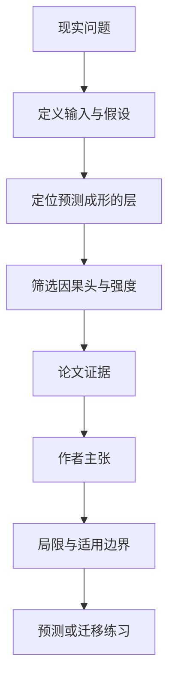

# Deep Noir：自动寻找 Transformer 中该在哪一层做行为引导

英文原题：Deep Noir: Autonomous Steering Discovery via Architectural Chronometry in Transformer Models

arXiv：2609.20722v1；方向：AI；发布日期：2026-09-17

一句话问题：想在不重新训练模型的情况下改变分类行为，怎样自动找到干预层、注意力头和强度，又不把模型其他能力一起弄坏？

## 先从一个普通人会遇到的问题开始

activation steering 像在模型内部推一把，但过去常靠人工试层数和强度；论文用预测何时成形与哪些注意力头有因果作用来自动选点，并同时发现干预会制造提示注入攻击面。

今天读完《Deep Noir：自动寻找 Transformer 中该在哪一层做行为引导》，目标不是记住论文名，而是能用自己的话回答：想在不重新训练模型的情况下改变分类行为，怎样自动找到干预层、注意力头和强度，又不把模型其他能力一起弄坏？还要能指出作者的证据支持到哪一步、哪一步仍不能下结论。

## 整体关系图



## 先补两块必要基础

activation steering（激活引导）是在推理时给中间表示加一个方向向量，让输出更偏向某种行为，不改模型权重。Logit Lens 把中间层投影成词概率，用来观察预测何时稳定。

相关不等于因果。某个注意力头与目标相关，未必是改变结果的关键；论文用 head-level causal attribution 筛出真正影响目标的头，再搜索引导强度。

## 论文接收什么，输出什么

输入是少量探针样本、目标行为、模型各层中间激活和候选引导方向。输出是层、头掩码、强度组成的干预配置。

中间状态包括 Logit Lens 收敛位置、各头的因果贡献、候选配置准确率、对非目标任务的泄漏和提示注入脆弱性。

## 第一步：用预测收敛时间缩小候选层

若模型在某层之前还没有形成目标判断，太早推可能被后续计算冲淡；太晚推又没有传播空间。Deep Noir 观察中间层输出何时开始稳定来选择搜索区域。

不同架构的最佳区域不同：论文报告 Llama 偏早/中层、OLMo 偏后层、Gemma 偏深层，因此固定“第几层最好”不能跨模型照搬。

## 第二步：因果筛头并搜索最小有效强度

系统测试哪些头真正改变分类，再只对选中结构施加方向。这样比无掩码的表示工程更有针对性，也能观察非目标能力是否受损。

强度越大不一定越好。论文显示引导可形成可预测的提示注入攻击面，脆弱性随强度上升，因此优化必须同时看目标增益和安全泄漏。

## 跟着一个小例子看中间状态

假设垃圾邮件判断在第 8—12 层趋于稳定，因果测试发现其中两个头最影响结果。系统比较强度 0.5、1.0、1.5：准确率上升，但 1.5 的注入绕过明显增加，于是不能只选最高准确率。

同一配置迁移到情感分类时，收敛层和方向可能不同；“零代码改任务”是框架接口不变，不代表无需新探针与重新发现参数。

## 作者拿什么证据支持主张

1B 规模的 39 次垃圾邮件运行平均提高 16.7 个百分点，标准差 4.7；在 7—9B 的四种架构上增益为 21—42 个百分点。SST-2 情感任务提高 13.1 个百分点。

50 个探针发现的配置在完整 872 样本 SST-2 验证集上从 76.9% 提到 84.3%。论文还报告脆弱性随引导幅度单调变化，并检查 MMLU 泄漏。

## 哪些结论不能顺手扩大

优势最明确的是二元分类；复杂推理、数学和指令跟随尚未证明。每个模型家族/规模组合样本有限，7B 模型使用 4-bit 量化。

线性方向可能漏掉非线性边界，跨折方差高于对照，且更大模型尚未测试。引导方向可被推断时，安全攻击面无法仅靠提高准确率解决。

## 把整条因果链重新接起来

研究问题“想在不重新训练模型的情况下改变分类行为，怎样自动找到干预层、注意力头和强度，又不把模型其他能力一起弄坏？”先被拆成可观察输入，再经过“第一步：用预测收敛时间缩小候选层”与“第二步：因果筛头并搜索最小有效强度”，最后由论文实验或数据核对。

排错时依次检查：输入是否代表真实问题、中间状态是否按定义计算、比较组是否公平、指标是否回答原问题、结论是否越过样本和假设边界。

## 最小实践：把核心机制跑一遍

需求：用一组明确标为教学设定的小数据演示“用三组候选层和强度说明为何要联合看目标增益与注入风险”。脚本打印输入、中间状态、正常例和失效边界，便于逐步核对。

验收标准：输出能解释机制方向，并明确它没有复现论文数据、模型或效果数字。

实际运行输出：

```text
教学输入：
- 候选层：[6, 10, 14]
- 候选强度：[0.5, 1.0, 1.5]
- 选择指标：准确率增益与攻击风险
中间状态：
1. 用中间预测找收敛区域
2. 用干预筛选因果头
3. 比较不同强度收益
4. 在风险过高前停止
正常例：选择能提升目标且未越过风险阈值的配置，而不是最大强度。
边界：没有加载 Transformer 或复现论文准确率；数值只演示多目标选择。
```

## 自测题

1. 为什么固定在所有模型的第 10 层引导不可靠？
2. 准确率继续升高但注入脆弱性也升高时，应该怎样报告？
3. 50 个探针有效是否足以证明对所有任务泛化？

## 原文与阅读范围

已读自动发现算法、跨规模/任务实验、保持能力与注入测试、讨论和限制；核对算法 1、表 1—2、图 1—2。

教学中的日常类比、演示数据和运行结果由本学习包构造；作者主张与论文证据已在正文中单独标出，二者不混用。

本次保存并解析的正文格式为 arxiv_html，提取到 5 个相关章节、20 条图表说明，正文约 54,274 个字符。

原文：https://arxiv.org/html/2609.20722v1
