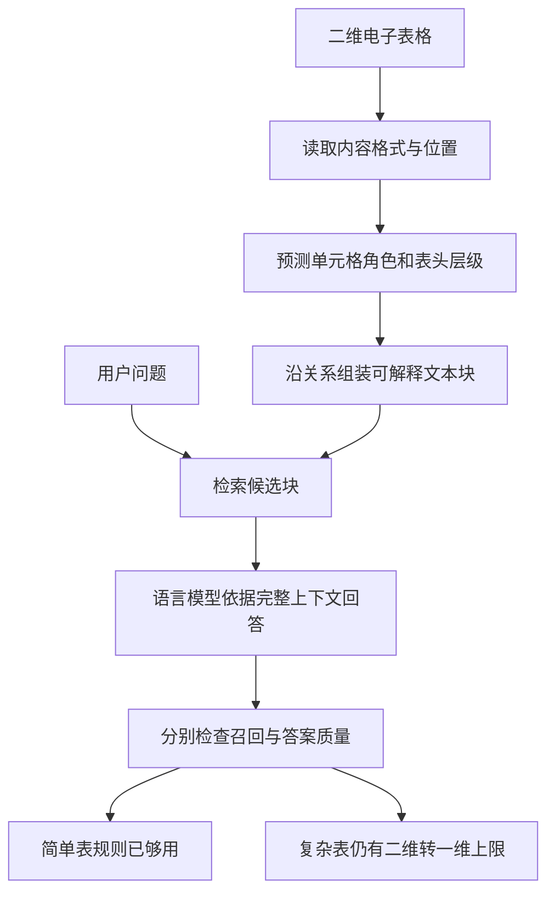

# 回答任意电子表格问题，需要先读懂网格结构

英文原题：Q&A on Any Spreadsheet Requires Interpreting Its Grid Structure

arXiv：2609.20732v1；方向：AI；发布日期：2026-09-17

一句话问题：同一个数字已经被检索出来，为什么模型仍可能答错它代表哪个地区、年份和指标？

## 数字找到了，含义却在切表时丢了

一张表第一行写“收入”，第二行分“亚洲、欧洲”，第三行再分“2025、2026”。若切块只留下单元格“51.5”，搜索可能仍能靠邻近词找到它，但回答者不知道这是亚洲还是欧洲、收入还是成本。

论文研究的不是让语言模型一次吞下整本 Excel，而是切块前先给单元格标注角色，再把值和正确的表头层级装进同一块。读完你应能区分“找到块”和“理解块”，也能解释为何人类完美标签仍不能彻底解决任意电子表格问答。

## 整体关系图



## 电子表格为什么不是普通的一维文本

文本通常按句子从左到右展开；电子表格的意义同时来自上、下、左、右、合并区域、格式和多个表。一个值可能被行标题、列标题、上层组标题共同描述，空白也可能表示视觉分隔而非缺失数据。

RAG 的第一步是 chunking，也就是把大资料切成可检索的小块。切得太碎会丢表头，切得太大又增加噪声。论文把角色分到标题、不同深度表头、数据、注释等有限类别，再用角色组装 grid-aware chunk。

## 方法吃什么，吐出什么

单元格模型读取内容、格式、位置以及可选的邻接关系，输出每个单元格的角色。论文训练六个网络：三种逐单元格分类器和三种会利用图关系的模型，以检验收益是否只来自某个特定架构。

组装器据角色把一个值、它的行标签和多层列标签放在一起，形成一维文字块。用户问题先检索块，再由语言模型生成答案。评估因此分两段：Recall@1/@5 看有没有找对块，人类 1—5 分看看到块后是否答得清楚。

## 第一步：给“表头”加上层级

只标“header”仍不够。上层“亚洲”约束一大片列，下层“2025”只约束其中一列；若不区分深度，组装器可能把“欧洲”贴到亚洲数值旁。角色的用途不是漂亮地给格子上色，而是恢复 header → value 的解释路径。

论文把约一百万个带标签单元格用于角色学习，并比较非关系分类器、使用固定邻接的 GCN/GAT，以及学习邻接的图模型。更复杂模型不自动最好；最终应看它产生的块能否帮助实际问答。

## 第二步：检索与生成要分开验

一个块即使表头有错，也可能含有问题中的关键词，因此被搜索出来；真正答题时，错误或缺失的结构才暴露。论文部署 16 个检查点并发现，单元格宏 F1 与检索召回关系弱，却与人类答案评分更相关。

这解释了一个反直觉结果：结构标注主要改善生成理解，不明显改善检索。不能只看 Recall@5 就宣布电子表格 RAG 做好了；也不能因为分类 F1 高，就跳过端到端问题。

## 沿一个嵌套表头走完整条链

问题是“亚洲 2025 年收入是多少？”中间状态依次为：识别“收入”为指标、“亚洲”为一级列头、“2025”为二级列头；定位交叉值 51.5；组装成“指标=收入；地区=亚洲；年份=2025；值=51.5”；检索后才生成句子。

若表是简单的首行列名，固定规则已经足够；若一页混着多个表、合并单元格和注释，角色模型更可能有价值。读者应先观察结构复杂度，再判断是否值得引入学习模型。

## 480 个问题说明了什么

论文在 480 个问题上由人工按 1—5 分评答案。最佳学习角色的块得到 3.88，最强对照 STC 为 3.43；使用人工金标准角色组块为 4.01。这个差距支持“角色上下文有帮助”，也暴露即使角色完美仍有明显上限。

按表结构拆分时，嵌套表头的收益最大；简单平面表中，首行表头规则几乎不输。消融还显示不同角色的重要性不同。结论应是按结构选择方法，而不是所有 Excel 都先跑最复杂图网络。

## 为什么作者最后反而说要超越角色分类

现实网格的关系连续且角色可能无限，分类器却只能从有限预定义类别中选一个。人工角色只把 3.88 推到 4.01，说明瓶颈已经部分转移到“怎样把二维关系压成一维块”，而非单纯把角色认得更准。

评分依赖特定数据、问题、组块策略和人类判断；论坛讨论比例也不是行业普查。教学例子没有训练神经网络，只验证结构化文字比裸数字信息更多，不能当成论文效果复现。

## 一条完整但不神化的主线

任意表格先被读成带位置和格式的网格；模型推断单元格角色与层级；组装器沿表头关系生成含义完整的文本块；检索找块；生成模型读块答题；最后分别核对检索和答案。

出错时按层排查：原值是否读对、表头层级是否标对、块是否带齐上下文、问题是否找到正确块、生成是否引用正确值。把这些步骤混成一个总分，就无法知道该改分类器还是改切块。

## 最小实践：让 51.5 带回自己的表头

需求：用一个双层列头小表，比较“只保存值”和“保存指标、地区、年份、值”的块。正常例回答亚洲 2025 收入；边界例显示重复表头或合并规则错误仍会组装错。这个算例验证信息保留，不评价神经网络。

实际运行输出：

```text
裸值块：51.5 | 57.0 | 48.0 | 49.5
结构块：指标=收入；地区=亚洲；年份=2025；值=51.5
问题：亚洲 2025 年收入？答案：51.5
中间状态：一级表头=亚洲，二级表头=2025，指标=收入，交叉值=51.5
边界：规则已预先知道这张小表的层级；它没有解决合并单元格、多表混排或任意角色学习。
```

## 自测题

1. 为什么角色标签可能几乎不改变 Recall@5，却提高最终答案评分？
2. 一张只有首行列名的规整表，是否应默认使用图神经网络？
3. 人工角色已经全对但答案仍错，下一步优先检查哪两层？

## 原文与阅读范围

已读取方法、六类模型、端到端 RAG 实验与讨论；核对图 1—4、表 1—5，以及附录中的架构与 16 个检查点结果。

论文证据支持结构标签改善检索后的理解，尤其是嵌套表头；本页的小表和确定性组装器为教学设计，未训练或复现论文模型。

本次保存并解析的正文格式为 arxiv_html，提取到 3 个相关章节、22 条图表说明，正文约 64,524 个字符。

原文：https://arxiv.org/html/2609.20732v1
