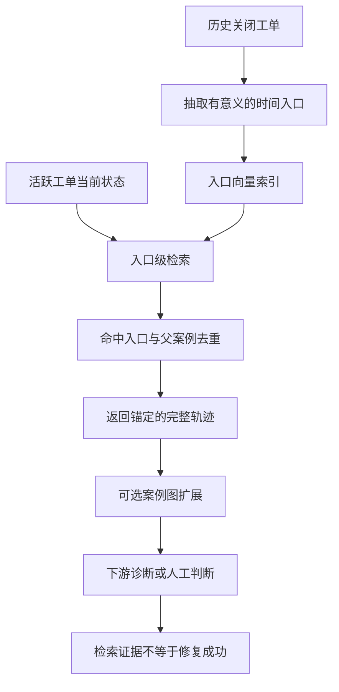

# RAFT：面向故障排查智能体的有状态检索增强框架

英文原题：RAFT: A Stateful Retrieval-Augmented Framework for Troubleshooting Agents

arXiv：2609.20754v1；方向：AI；发布日期：2026-09-17

一句话问题：客服只知道故障进行到哪一步时，怎样从历史工单中找到“同阶段、后来解决了”的案例？

## 为什么搜到相同报错，仍可能给错下一步

设想两个网站都报“无法访问”。一个刚开始排查，另一个已经确认 DNS 正常、只剩证书握手失败。若把整张工单压成一个文本向量，两个阶段会被揉在一起；检索结果可能只共享开头症状，却对眼下的证据没有帮助。

这篇论文把历史工单改写成一串有方向的“调查状态”。读完后，你应能说明 RAFT 的输入、入口级检索、锚定轨迹和可选图扩展分别做什么，也能判断论文证明的是检索改善，而不是自动修好故障。这里的看病类比只帮助理解阶段；真实工单还包含日志、隐私和工具调用。

## 整体关系图



## 先分清 RAG、工单与调查状态

RAG（retrieval-augmented generation）先从私有资料中找证据，再交给语言模型回答。普通 RAG 常把一篇文档或固定小段当检索单位。故障工单却会逐步加入假设、检查结果、失败尝试和最终修复，后面的状态依赖前面的排除过程。

RAFT 把一个已关闭案例抽象为有向时间链。每个 timeline entry 不是原消息的随意切片，而是某个有意义阶段的技术状态。这样，“当前已排除了什么”也能参与匹配；命中的入口仍属于原案例，所以系统还能带回它前后发生了什么。

## 输入、输出和中间状态是什么

离线输入是历史已关闭案例。工作代理分批读取原始证据并维护 evolving case state，审阅代理可检查来源、修正状态并标记案例是否具有可操作性。输出是经过脱敏和结构化的入口链，以及每个入口的向量表示。

在线输入是活跃工单到当前时刻已有的信息。系统先检索最相似的历史入口，去重后取得其父案例，再从命中的锚点带回连贯轨迹。可选的案例图按可配置相似属性连接案例，用剩余预算扩展到直接入口检索没找到的邻居。

## 关键一步：在入口层匹配“现在处在哪”

普通整案检索容易由高频开场词主导，例如“服务不可用”。入口级检索把“证书链校验失败”“磁盘已满”这样的中间状态分别暴露出来。随着活跃案例从 0% 进展到 60%，理想命中位置也应沿历史轨迹向后移动，而不是一直匹配第一条症状。

论文表 3 给出这个预期行为：平均匹配深度从 0% 进展时的 9.1%，移到 60% 进展时的 54.0%。它不是说越靠后越好，而是说匹配位置随查询阶段改变；深度本身不等于正确率。

## 命中之后：锚定轨迹与可选图扩展

只返回一句相似日志仍不够。RAFT 从命中的入口回到父案例，让使用者看到这个状态之前怎样排除、之后怎样修复。眼前一步提供战术提示，完整轨迹提供战略上下文；外部故障排查智能体还可以改写查询，再次检索。

案例图不是必需的“神奇推理层”。它用案例级属性连接近邻，并在预算允许时补充同类案例。论文也发现通用实体图基线可能不如普通 RAG：当任务需要的是相似调查轨迹，而非跨文档实体推理，额外图结构可能增加噪声和构建成本。

## 用一张小工单跟着走

活跃工单依次出现：网站 503；DNS 正常；TLS 握手报证书链错误。第一阶段可能匹配许多“网站不可用”案例；第三阶段应优先命中历史案例中的证书校验入口，并返回后来更新中间证书、重启网关的轨迹。

要观察的中间状态包括：当前查询包含哪些已确认事实、命中哪个入口、入口属于哪个父案例、去重后还剩几条轨迹、图扩展用了多少预算。若最终建议错了，应定位是抽取、匹配、轨迹内容还是下游推理出错，不能把所有失败都归为“RAG 不准”。

## 论文的证据支持到哪里

合成基准由 Microsoft Learn 的 Windows Server 排障文档构造，共 826 个支持案例。表 2 中，RAFT 在案例进展 0%、30%、60% 时的 Case Hit 分别为 0.842、0.871、0.888；普通 RAG 为 0.673、0.719、0.769。相对最强普通基线的差异按根因组聚类 bootstrap，在三个进展点均达到统计显著。

真实数据检查使用 30 个经人工审核的 Apache Jira 重复问题组和 570 个干扰项。Case Hit 也提高，但作者没有给这部分置信区间，因此把它称为方向性迁移证据更准确。Case Hit 只问是否找到了匹配案例；根因覆盖、修复步骤覆盖和真正解决故障是不同结果。

## 三个不能跨过去的证据边界

第一，主要实验仍是中等规模合成数据，生产工单更长、更脏、权限更复杂。第二，Jira 只有 30 个审核组，不能据此宣称在所有企业工单上稳定有效。第三，论文刻意只评估检索层，没有测最终诊断成功率、解决时间或工程师生产率。

结构化入口还依赖模型抽取和审阅质量；相似历史可能继承过期操作或敏感信息。部署时需要脱敏、权限、来源链接、拒答和人工复核。我们的教学算例只展示“同阶段比整案词频更有辨识力”，不复现论文的模型、嵌入、图或数据集。

## 把论文主线压成一句可排错的话

历史工单先变成“状态入口 → 有向轨迹”；活跃工单再以当前状态检索入口；命中入口锚定父案例轨迹；可选图只在预算内扩展；最后用案例命中与证据覆盖核对检索，而不提前声称故障已经修复。

若系统总找开场相似但后续无关的工单，先看入口抽取和查询阶段信息；若命中入口正确但建议跳步，检查返回轨迹；若轨迹正确却执行失败，问题已进入下游代理或真实环境，而不是继续调检索排名。

## 最小实践：整案词袋与阶段入口

需求：构造三个教学工单，把活跃查询分别与“整案文本”和“单个调查入口”做词集合重叠；显示入口命中及其后续轨迹。正常例应命中证书阶段，边界例说明同义词和语义相似无法由这个简陋分词器处理。

实际运行输出：

```text
整案重叠排名：证书案例(6) > 磁盘案例(0) > 数据库案例(0)
入口命中：证书案例 第2阶段，得分 6：DNS 正常 TLS 握手 证书链 错误
锚定后续：DNS 正常 TLS 握手 证书链 错误 → 更新 中间证书 重启 网关 恢复
边界：这是精确词集合教学检索；同义词、抽取错误、权限和真实解决效果均未验证。
```

## 自测题

1. 活跃工单只写“网站打不开”时，为什么 RAFT 的优势可能比出现证书错误后更小？
2. Case Hit 提高能否推出平均修复时间一定下降？还缺什么实验？
3. 若命中入口正确，但返回轨迹包含已经过期的操作手册，应在哪一层增加控制？

## 原文与阅读范围

已读取第 1 节、方法架构、实验与限制；核对图 1—2、算法 1、表 2—4，并查看附录中的扰动与容量消融说明。

作者的主张是有状态入口表示改善排障检索；教学中的网站、证书和词集合是自造例子。未复现 826 案例抽取、嵌入模型、Jira 实验或端到端智能体。

本次保存并解析的正文格式为 arxiv_html，提取到 4 个相关章节、13 条图表说明，正文约 65,721 个字符。

原文：https://arxiv.org/html/2609.20754v1
