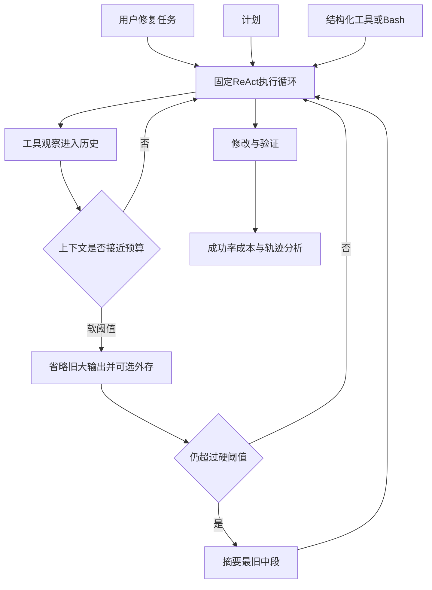

# 编码智能体的 Harness 设计：一项组件级实证研究

英文原题：An Empirical Study of Harness Design for Coding Agents

arXiv：2609.20804v1；方向：AI；发布日期：2026-09-17

一句话问题：同一个大模型接到同一修复任务，为什么只改上下文管理、计划或工具接口，成功率和成本就会明显变化？

## 不是只换模型：车手相同，驾驶舱也会改变结果

编码智能体不是模型裸奔。外层软件决定每轮给它看哪些历史、能调用什么工具、计划怎样保存、命令结果怎样回填。这个外层称为 harness，可理解为把模型能力变成可执行工作流的“驾驶舱”。

论文固定执行循环，只改变计划、动作空间和上下文管理，在四个模型、两个基准中做组件级比较。读完你应能解释每个组件改变了哪种中间行为，并拒绝“某个组件永远最好”的简单结论。

## 整体关系图



## Harness 的三个旋钮

计划组件维护显式任务清单；动作空间要么给 read_file、edit_file 等结构化工具，要么主要依赖 bash；上下文管理决定长轨迹里哪些原文保留、哪些工具输出省略、何时用模型摘要。

执行循环采用 ReAct 风格：模型看到当前上下文，发工具调用，环境执行并把观察追加到历史。权限、卡死检测和其他机制保持固定，因此对照更接近在问“这个组件在当前条件下有什么边际作用”。

## 176 个设置怎样组成

作者测试 Nemotron-3 的 30B、120B、550B 三种规模和 Mistral-Medium-3.5-128B，在 SWE-Bench Verified 与 Terminal-Bench 2.1 上运行。上下文预算为 32k、64k、96k、128k，管理策略从 T0 到 T4。

T0 不压缩，超窗就终止；T1 省略旧的大工具输出；T2 让省略内容可通过 recall_event 找回；T3 只用模型摘要；T4 先省略、必要时再摘要，并保留前言与最近轮次。计划和动作空间的消融在 T4/128k 条件下进行。

## 上下文管理主要救的是“还没做完就被截断”

当窗口很小时，未管理历史会在智能体定位、修改或验证前塞满。管理策略不一定让模型变聪明，而是让轨迹活得足够长。论文发现所有受管理层级在各预算中都没有上下文溢出终止。

SWE-Bench 上，四种管理策略相对 T0 的平均成功率差在 32k 时为 35.7 个百分点，到 128k 只剩 2.7；Terminal-Bench 对应从 9.5 降到 2.8。收益随预算变大而收窄，支持“主要机制是防溢出”，而非普遍推理增强。

## 计划和工具的价值随模型与任务改变

较弱模型启用计划后，更可能走到实际编辑阶段，成功率提高但也花更多；较强模型本就能推进，计划主要减少重复验证和成本，准确率变化小。计划因此可能是能力脚手架，也可能只是效率工具。

预定义工具帮助 bash 能力弱的模型，把意图约束成清晰操作；bash 熟练的强模型可用更低成本完成命令行任务。动作接口还改变写代码的粒度。若只比较最终成功率，容易看不到它通过何种行为路径起作用。

## T4 到底怎样处理一条变长的历史

历史被分成稳定前言、较旧中段和最近轮次。超过软阈值时，T4 先把中段庞大工具输出换成短占位并存到外部；超过硬阈值时，再摘要更旧事件。最近操作保持原文，避免模型忘掉刚改了什么。

论文中可找回机制极少被调用，且相对只省略没有提高准确率。这不等于所有系统都应删除 recall：在需要精确回查长日志的任务上可能不同。它只说明被测模型和任务没有利用这层额外机器。

## 怎样读成功率表而不挑一个冠军

实验有 176 个匹配设置，并用任务配对的 McNemar 检验及多重比较校正。T4 在八个模型—基准组合中有七个平均成本最低，成功率与其他管理层级相近；这支持“先便宜省略、后昂贵摘要”的效率解释。

但表中最佳配置随模型、窗口和基准变化。例如 32k 的管理收益巨大，128k 就小得多；bash-only 对某些强模型有利、对另一些模型伤害明显。正确产出是条件化设计规则，不是一张永恒排行榜。

## 这不是所有编码智能体的万能配方

计划只有一种提示与更新方式，工具和摘要也只有特定实现；模型、定价、基准与最大 300 步会变化。组件还有交互，单独消融不能覆盖所有组合。论文估计的是这些实现的条件效果。

成功基准不等于真实代码可维护性、安全性或团队协作。教学 demo 只计算字符预算并模拟省略/摘要，不能重现模型行为、成本或 SWE-Bench 成绩。

## 从用户任务到提交补丁的全链

用户任务进入固定循环；计划维持目标；动作空间把意图变成命令；工具观察累积成历史；上下文策略在阈值处省略或摘要；模型继续定位、修改、验证；基准判定结果，同时记录成本、溢出和轨迹阶段。

排错时先看终止原因：若超窗，调上下文；若长期停在定位，计划或工具可能不足；若反复大块重写，动作粒度有问题；若成功但成本高，再看冗余验证和摘要频率。

## 最小实践：先省略，再摘要

需求：给一串不同大小的历史事件，比较不管理时是否超过 100 字符预算，以及教学版 T4 怎样先将旧工具输出替换为占位，再在仍超限时摘要。正常例避免溢出；边界说明语义是否保留没有被字符计数验证。

实际运行输出：

```text
T0 原始上下文：106 字符，是否溢出=True
T4 省略后：55 字符；分阶段处理后：55 字符
保留状态：前言: 修复测试失败 | [旧工具输出已省略] | [旧工具输出已省略] | 最近: 已定位文件 | 最近: 准备改动
边界：字符变少不证明摘要保留了修复语义，也不复现模型成功率、调用成本或真实上下文计数。
```

## 自测题

1. 为什么 32k 窗口中上下文管理的成功率收益通常比 128k 大？
2. T2 的 recall_event 很少被用，能否推出可找回存储在所有智能体中都没价值？
3. 一个强模型用 bash-only 更便宜，是否应给弱模型也立刻删掉结构化工具？

## 原文与阅读范围

已读取架构、实验协议、主结果、轨迹分析和限制；核对图 1—9、表 2—7，以及附录中的提示、工具和失败阶段定义。

论文证据来自四个模型、两个基准和 176 个设置；教学字符压缩器只展示阈值顺序，不是智能体或摘要质量复现。

本次保存并解析的正文格式为 arxiv_html，提取到 6 个相关章节、56 条图表说明，正文约 124,771 个字符。

原文：https://arxiv.org/html/2609.20804v1
